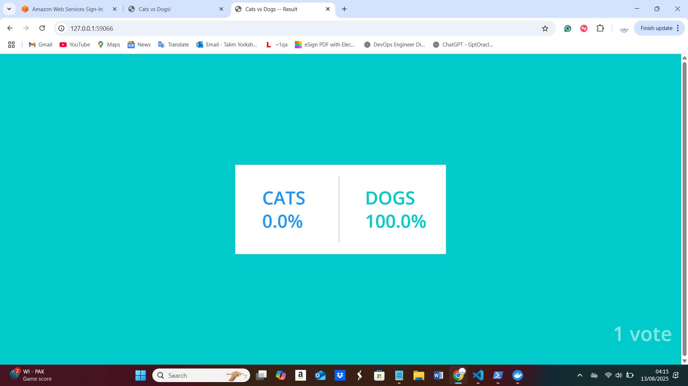

# Voting App (Docker → ECR → EC2/EKS)

This project demonstrates how I deployed the **Example Voting App** end-to-end with Docker, AWS ECR, and EC2/EKS (via SSM).

## Architecture
- **vote** (Flask app) — users cast A/B votes
- **result** (Node app) — shows live results
- **worker** (background processor)
- **Redis** (queue) + **Postgres** (database)

```mermaid
flowchart LR
  V[vote] --> R[(Redis)]
  W[worker] --> R
  W --> D[(Postgres)]
  Rz[result] --> D


Run Locally
docker compose up -d
# Vote UI:   http://localhost:5000
# Result UI: http://localhost:5001

Push Images to AWS ECR
AWS_ACCOUNT_ID=<your-id>
AWS_REGION=eu-west-2
URI=$AWS_ACCOUNT_ID.dkr.ecr.$AWS_REGION.amazonaws.com

aws ecr get-login-password --region $AWS_REGION \
 | docker login --username AWS --password-stdin $URI

docker build -t vote ./vote
docker tag vote:latest $URI/vote:latest
docker push $URI/vote:latest

Run on EC2 (via SSM)
aws ssm send-command \
  --document-name "AWS-RunShellScript" \
  --targets "Key=instanceIds,Values=i-xxxxxxxx" \
  --parameters 'commands=["docker run -d -p 5000:80 <ECR_URI>/vote:latest"]'

(Optional) Run on EKS

Apply Kubernetes manifests (Deployments + Services)

Rollout: kubectl rollout status deployment/vote




Build your own images (if you have the app code locally)

Assuming you have directories like ./vote, ./result, ./worker each with a Dockerfile.

Bash (Git Bash / WSL):

AWS_ACCOUNT_ID=<YOUR_AWS_ACCOUNT_ID>
AWS_REGION=<YOUR_REGION>
URI="$AWS_ACCOUNT_ID.dkr.ecr.$AWS_REGION.amazonaws.com"

aws ecr get-login-password --region "$AWS_REGION" \
  | docker login --username AWS --password-stdin "$URI"

for repo in vote result worker; do
  aws ecr describe-repositories --repository-names "$repo" \
  || aws ecr create-repository --repository-name "$repo"
done

# build → tag → push for each service
docker build -t vote:latest   ./vote
docker tag   vote:latest       "$URI/vote:latest"
docker push  "$URI/vote:latest"

docker build -t result:latest ./result
docker tag   result:latest     "$URI/result:latest"
docker push  "$URI/result:latest"

docker build -t worker:latest ./worker
docker tag   worker:latest     "$URI/worker:latest"
docker push  "$URI/worker:latest"


PowerShell:

$AWS_ACCOUNT_ID = "<YOUR_AWS_ACCOUNT_ID>"
$AWS_REGION     = "<YOUR_REGION>"
$URI            = "$AWS_ACCOUNT_ID.dkr.ecr.$AWS_REGION.amazonaws.com"

aws ecr get-login-password --region $AWS_REGION `
  | docker login --username AWS --password-stdin $URI

foreach ($repo in @("vote","result","worker")) {
  aws ecr describe-repositories --repository-names $repo `
    2>$null `
    || aws ecr create-repository --repository-name $repo
}

docker build -t vote:latest   ./vote
docker tag   vote:latest       "$URI/vote:latest"
docker push  "$URI/vote:latest"

docker build -t result:latest ./result
docker tag   result:latest     "$URI/result:latest"
docker push  "$URI/result:latest"

docker build -t worker:latest ./worker
docker tag   worker:latest     "$URI/worker:latest"
docker push  "$URI/worker:latest"

Verify in AWS Console

Go to ECR → Repositories and you should see vote, result, worker with the latest tag.

You can now use these images on EC2 (via SSM) or EKS/Helm.

Tip: if login fails, ensure your AWS CLI is authenticated (aws sts get-caller-identity) and your IAM user/role has ecr:* permissions (or at least the standard push actions).